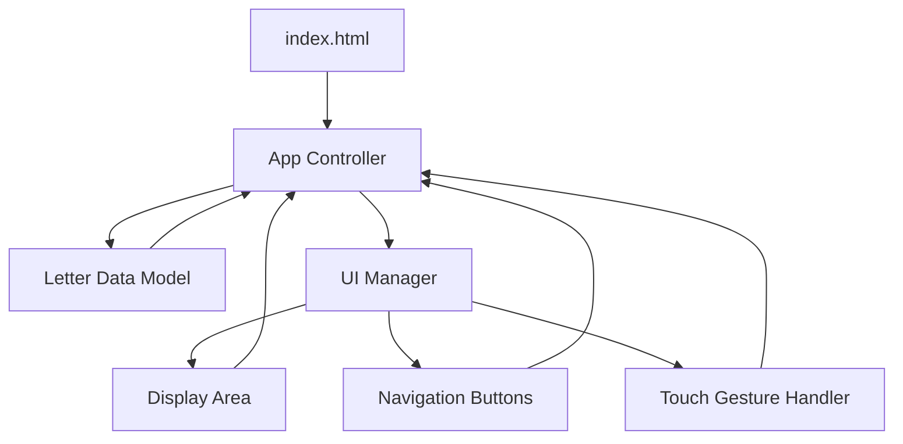

# Design Document: Hijaiyah Learning Web

## Overview

The Hijaiyah Learning Web application is a single-page web application (SPA) built with vanilla HTML, CSS, and JavaScript. It provides an interactive, touch-friendly interface for young children (specifically 2-year-olds) to learn the 28 letters of the Arabic alphabet (Hijaiyah).

The application follows a minimalist architecture with no external dependencies, ensuring offline functionality and fast load times. The design prioritizes simplicity, large touch targets, and engaging visuals to maintain a toddler's attention while providing an effective learning tool.

### Key Design Principles

1. **Zero Dependencies**: Pure HTML, CSS, and JavaScript with no frameworks or libraries
2. **Offline-First**: All resources bundled locally, no network requests required
3. **Touch-Optimized**: Large buttons (minimum 44x44px), swipe gestures, and immediate visual feedback
4. **Performance-Focused**: Minimal DOM manipulation, CSS transitions for smooth animations
5. **Accessibility**: High contrast colors, large text, simple navigation patterns

## Architecture

### Application Structure

The application follows a simple Model-View-Controller (MVC) pattern adapted for vanilla JavaScript:

```
hijaiyah-learning-web/
├── index.html          # Main HTML structure
├── styles/
│   └── main.css        # All styling (responsive, animations, themes)
├── scripts/
│   ├── data.js         # Hijaiyah letters data array
│   ├── app.js          # Application state and logic
│   └── ui.js           # DOM manipulation and event handlers
└── README.md           # Setup and usage instructions
```

### Component Architecture



### State Management

The application maintains a simple state object:

```javascript
{
  currentIndex: 0,           // Current letter index (0-27)
  letters: [...],            // Array of 28 Hijaiyah letters
  isTransitioning: false     // Prevents rapid navigation during animations
}
```

State changes trigger UI updates through a unidirectional data flow pattern.

## Components and Interfaces

### 1. Data Layer (data.js)

**Purpose**: Provides the Hijaiyah letters dataset

**Interface**:
```javascript
const HIJAIYAH_LETTERS = [
  { id: 1, arabic: 'ا', name: 'Alif' },
  { id: 2, arabic: 'ب', name: 'Ba' },
  // ... 26 more letters
  { id: 28, arabic: 'ي', name: 'Ya' }
];
```

**Responsibilities**:
- Store all 28 Hijaiyah letters in traditional order
- Provide letter data with Arabic character and romanized name
- Serve as single source of truth for letter content

### 2. Application Controller (app.js)

**Purpose**: Manages application state and business logic

**Interface**:
```javascript
class HijaiyahApp {
  constructor(letters)
  getCurrentLetter()
  nextLetter()
  previousLetter()
  goToLetter(index)
  isValidIndex(index)
}
```

**Responsibilities**:
- Initialize application state
- Handle navigation logic (next, previous, wrap-around)
- Validate state transitions
- Notify UI of state changes

### 3. UI Manager (ui.js)

**Purpose**: Handles all DOM manipulation and user interactions

**Interface**:
```javascript
class UIManager {
  constructor(app)
  init()
  updateDisplay(letter)
  setupEventListeners()
  handleNextClick()
  handlePreviousClick()
  handleSwipe(direction)
  showTransition(direction)
}
```

**Responsibilities**:
- Render letter cards in the display area
- Handle button clicks and touch events
- Manage swipe gesture detection
- Apply CSS transitions for smooth animations
- Provide visual feedback for interactions

### 4. Touch Gesture Handler

**Purpose**: Detect and process swipe gestures

**Implementation**: Embedded within UIManager

**Logic**:
- Track touchstart coordinates
- Calculate touchend delta
- Determine swipe direction (left/right) based on threshold (50px minimum)
- Ignore vertical swipes
- Trigger navigation based on horizontal swipe direction

### 5. Display Area Component

**Purpose**: Visual container for letter cards

**HTML Structure**:
```html
<div class="display-area">
  <div class="letter-card">
    <div class="letter-arabic">ا</div>
    <div class="letter-name">Alif</div>
  </div>
</div>
```

**CSS Features**:
- Flexbox centering for letter content
- Large font size (responsive, minimum 120px)
- High contrast colors (configurable background/foreground)
- Smooth fade/slide transitions

### 6. Navigation Component

**Purpose**: Provide touch-friendly navigation controls

**HTML Structure**:
```html
<div class="navigation">
  <button class="nav-button prev-button" aria-label="Previous letter">
    ◀
  </button>
  <button class="nav-button next-button" aria-label="Next letter">
    ▶
  </button>
</div>
```

**CSS Features**:
- Minimum 44x44px touch targets
- Large, rounded buttons
- Bright, contrasting colors
- Active state visual feedback (scale transform)
- Positioned at bottom of screen for easy reach

## Data Models

### Letter Model

```javascript
{
  id: Number,        // Unique identifier (1-28)
  arabic: String,    // Arabic character (e.g., 'ا')
  name: String       // Romanized name (e.g., 'Alif')
}
```

**Constraints**:
- `id` must be unique and sequential (1-28)
- `arabic` must be a valid Unicode Arabic character
- `name` must be a non-empty string

### Application State Model

```javascript
{
  currentIndex: Number,      // Current position in letters array (0-27)
  letters: Array<Letter>,    // Complete Hijaiyah dataset
  isTransitioning: Boolean   // Animation lock flag
}
```

**Constraints**:
- `currentIndex` must be >= 0 and < letters.length
- `letters` must contain exactly 28 Letter objects
- `isTransitioning` prevents concurrent navigation during animations

### Touch Event Model

```javascript
{
  startX: Number,    // Touch start X coordinate
  startY: Number,    // Touch start Y coordinate
  endX: Number,      // Touch end X coordinate
  endY: Number,      // Touch end Y coordinate
  deltaX: Number,    // Horizontal distance traveled
  deltaY: Number     // Vertical distance traveled
}
```

**Swipe Detection Logic**:
- Swipe left: `deltaX < -50` → next letter
- Swipe right: `deltaX > 50` → previous letter
- Ignore if `Math.abs(deltaY) > Math.abs(deltaX)` (vertical swipe)


## Correctness Properties

*A property is a characteristic or behavior that should hold true across all valid executions of a system—essentially, a formal statement about what the system should do. Properties serve as the bridge between human-readable specifications and machine-verifiable correctness guarantees.*

### Property 1: Arabic Text Rendering

*For any* letter displayed in the application, the DOM representation must use text nodes containing Arabic Unicode characters, not image elements.

**Validates: Requirements 1.1**

### Property 2: High Contrast Visibility

*For any* letter card displayed, the contrast ratio between the letter text and its background must meet or exceed 4.5:1 to ensure visibility.

**Validates: Requirements 1.3**

### Property 3: Single Letter Focus

*For any* application state, exactly one letter card must be visible in the display area at any given time.

**Validates: Requirements 1.4**

### Property 4: Touch Target Minimum Size

*For all* interactive elements (navigation buttons, swipeable areas), the touch target dimensions must be at least 44x44 pixels.

**Validates: Requirements 2.1, 4.3**

### Property 5: Sequential Navigation

*For any* valid letter index (0-26), navigating next from that index should display the letter at index + 1, and navigating previous should display the letter at index - 1.

**Validates: Requirements 2.2, 2.3**

### Property 6: Navigation Wrap-Around

*For any* navigation action at boundary positions, the application must wrap around: next from index 27 returns to index 0, and previous from index 0 returns to index 27.

**Validates: Requirements 2.4, 2.5**

### Property 7: Interactive Element Event Handling

*For all* interactive elements, click and touch event listeners must be attached and functional.

**Validates: Requirements 4.1**

### Property 8: Visual Feedback on Interaction

*For any* interactive element, when activated (clicked or touched), the element must provide visual feedback through CSS state changes or JavaScript-triggered style modifications.

**Validates: Requirements 4.2**

### Property 9: Swipe Gesture Navigation

*For any* swipe gesture on the display area, a left swipe (deltaX < -50) must trigger next letter navigation, and a right swipe (deltaX > 50) must trigger previous letter navigation.

**Validates: Requirements 4.4, 4.5**

### Property 10: Proportional Text Scaling

*For any* viewport width change within the supported range (320px-1024px), the letter text size must scale proportionally to maintain readability and fit within the display area.

**Validates: Requirements 5.3**

### Property 11: Responsive Touch Targets

*For all* supported screen sizes (320px-1024px width), interactive elements must maintain minimum 44x44px touch target dimensions.

**Validates: Requirements 5.4**

### Property 12: Navigation Performance

*For any* navigation action (button click or swipe), the time between user input and the display of the new letter card must not exceed 300ms.

**Validates: Requirements 8.1**

## Error Handling

### Input Validation

**Invalid Index Handling**:
- The `isValidIndex()` method validates index bounds before state changes
- Out-of-range indices are rejected silently, maintaining current state
- Wrap-around logic ensures indices always remain within valid range (0-27)

**Gesture Detection Edge Cases**:
- Ambiguous swipes (diagonal movements) are ignored if `|deltaY| > |deltaX|`
- Swipes below threshold (< 50px) are treated as taps, not navigation gestures
- Rapid successive swipes are debounced using the `isTransitioning` flag

### Browser Compatibility

**Touch Event Fallbacks**:
- Primary: Touch events (`touchstart`, `touchend`, `touchmove`)
- Fallback: Mouse events (`mousedown`, `mouseup`, `mousemove`)
- Pointer events considered for future enhancement

**Font Rendering**:
- Primary: System Arabic fonts (Tahoma, Arial, sans-serif)
- Fallback: Generic sans-serif if Arabic fonts unavailable
- Font loading detection not implemented (acceptable degradation)

### Performance Safeguards

**Animation Locking**:
- `isTransitioning` flag prevents concurrent navigation during animations
- Flag set at animation start, cleared at animation end (300ms)
- Rapid clicks/swipes queued or ignored based on flag state

**Memory Management**:
- No dynamic DOM creation/destruction (single letter card reused)
- Text content updated in-place rather than replacing elements
- Event listeners attached once during initialization, never removed

### Graceful Degradation

**No JavaScript Scenario**:
- Application displays static first letter (Alif)
- Navigation buttons non-functional but visible
- Acceptable degradation for educational content

**Small Screen Handling**:
- Below 320px width: layout may break (out of scope)
- Above 1024px width: content centered with max-width constraint
- Font size clamped to prevent excessive scaling

## Testing Strategy

### Overview

The testing strategy employs a dual approach combining unit tests for specific scenarios and property-based tests for universal behaviors. This ensures both concrete correctness and comprehensive coverage across the input space.

### Property-Based Testing

**Framework**: [fast-check](https://github.com/dubzzz/fast-check) for JavaScript

**Configuration**:
- Minimum 100 iterations per property test
- Each test tagged with feature name and property reference
- Tag format: `Feature: hijaiyah-learning-web, Property {number}: {property_text}`

**Property Test Coverage**:

1. **Property 1 (Arabic Text Rendering)**: Generate random letter indices, verify DOM contains Arabic text nodes
2. **Property 2 (High Contrast)**: Generate random color combinations, verify contrast ratio >= 4.5:1
3. **Property 3 (Single Letter Focus)**: Generate random navigation sequences, verify only one card visible
4. **Property 4 (Touch Target Size)**: Generate random viewport sizes, measure all interactive elements
5. **Property 5 (Sequential Navigation)**: Generate random valid indices, verify next/previous transitions
6. **Property 6 (Wrap-Around)**: Test boundary navigation from indices 0 and 27
7. **Property 7 (Event Handling)**: Verify event listeners attached to all interactive elements
8. **Property 8 (Visual Feedback)**: Generate random interactions, verify style changes occur
9. **Property 9 (Swipe Navigation)**: Generate random swipe deltas, verify correct navigation direction
10. **Property 10 (Proportional Scaling)**: Generate random viewport widths, verify text scales proportionally
11. **Property 11 (Responsive Touch Targets)**: Generate random screen sizes, verify minimum dimensions maintained
12. **Property 12 (Performance)**: Generate random navigation actions, measure response time < 300ms

### Unit Testing

**Framework**: Jest or Mocha (lightweight, no framework dependencies in production code)

**Unit Test Focus Areas**:

1. **Data Integrity**:
   - Verify HIJAIYAH_LETTERS array contains exactly 28 elements
   - Verify letters are in traditional Hijaiyah order
   - Verify each letter has required fields (id, arabic, name)

2. **State Management**:
   - Test initial state (currentIndex = 0)
   - Test state transitions for edge cases (boundaries)
   - Test isTransitioning flag behavior

3. **UI Rendering**:
   - Test letter card displays correct Arabic character
   - Test letter card displays correct romanized name
   - Test CSS classes applied correctly

4. **Gesture Detection**:
   - Test swipe threshold (50px minimum)
   - Test vertical swipe rejection
   - Test ambiguous gesture handling

5. **Responsive Behavior**:
   - Test layout at 320px, 768px, 1024px breakpoints
   - Test font size calculations at different viewports
   - Test button positioning across screen sizes

6. **Performance Benchmarks**:
   - Test initial load time < 2 seconds
   - Test navigation response time < 300ms
   - Test animation duration = 300ms

7. **Offline Functionality**:
   - Verify no external resource URLs in code
   - Test application loads without network
   - Verify all assets bundled locally

8. **Accessibility**:
   - Test ARIA labels present on navigation buttons
   - Test keyboard navigation (optional enhancement)
   - Test screen reader compatibility (basic)

### Integration Testing

**Manual Testing Checklist**:
- Test on physical devices (tablet and phone)
- Test with actual 2-year-old user (parent-supervised)
- Test swipe gestures with small hands
- Test in bright and dim lighting conditions
- Test offline mode (airplane mode)

**Browser Compatibility Testing**:
- Chrome/Edge (Chromium-based)
- Safari (iOS and macOS)
- Firefox
- Samsung Internet (Android)

### Test Execution

**Continuous Testing**:
- Run unit tests on every code change
- Run property tests before commits
- Run full test suite before releases

**Performance Monitoring**:
- Use Chrome DevTools Performance tab
- Monitor frame rates during animations
- Profile memory usage over extended sessions

### Success Criteria

Tests pass when:
- All property tests pass 100 iterations without failures
- All unit tests pass with 100% coverage of critical paths
- Manual testing confirms usability with target age group
- Performance benchmarks met on mid-range devices (2-3 year old phones/tablets)
- Application functions correctly offline on all tested browsers
